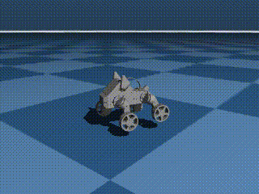
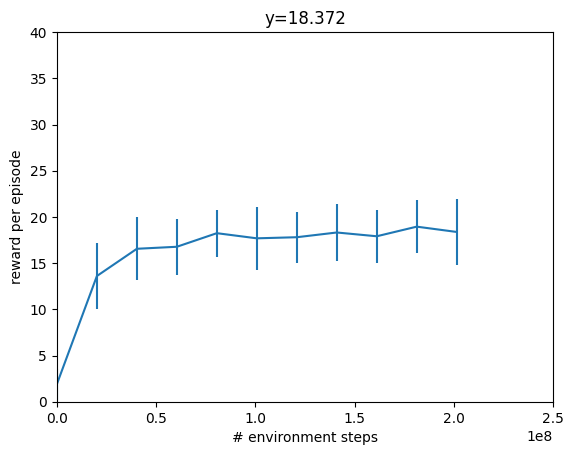

# Wheeled Pupper v3 Simulation – MuJoCo (MJX/JAX)

**Hybrid legged-to-wheeled locomotion adaptation for the Stanford Pupper quadruped.**


*Simulated Wheeled Pupper v3 tracking 0.75 m/s forward velocity with stable gait.*

## Overview

This repository hosts the **Sim-to-Real** training pipeline for the Wheeled Pupper v3, a hybrid robotics platform developed at the **University of Wisconsin–Madison LeggedAI Lab**. 

Leveraging the **MuJoCo MJX** physics engine and **JAX**, this project implements a high-fidelity digital twin that enables rapid **Reinforcement Learning (PPO)** of locomotion policies. The primary goal is to achieve seamless wheeled mobility through shape-memory polymer morphing adaptations.

### Key Features
- **Physics-Accurate Simulation**: Fully defined `Wheel_pupper.xml` model with joint limit modifications for continuous wheel rotation.
- **Massively Parallel Training**: PPO implementation using JAX/Brax to simulate thousands of environments in parallel on GPU (A100/L4).
- **Custom Reward Shaping**: Engineered reward functions prioritizing:
    - **Velocity Tracking**: Stable tracking up to **0.75 m/s**.
    - **Energy Efficiency**: Minimization of torque and mechanical power (Cost of Transport).
    - **Smoothness**: Penalties for jerk and acceleration changes to ensure hardware safety.
- **Domain Randomization**: Robustness conditioning for real-world deployment (friction, mass, perturbation noise).

## Key Results

The trained policy demonstrates stable, energy-efficient rolling gaits that outperform the baseline legged locomotion on flat terrain.

*   **Velocity**: Consistently achieves target velocities of 0.75 m/s.
*   **Stability**: Robust recovery from disturbances due to optimized PPO hyperparameters.
*   **Convergence**: Training stabilizes within 200M timesteps using the custom curriculum.


*Training curve showing reward convergence over 200M timesteps, validating policy stability.*

## Legged to Wheeled Conversion

This project represents a specific engineering adaptation of the standard Pupper v3:

1.  **Joint Limit Unlocking**: Modified actuator definitions in `Wheel_pupper.xml` to allow infinite rotation (`float('inf')`) for distal wheel joints (indices: `Wheel_FR`, `Wheel_FL`, `Wheel_BR`, `Wheel_BL`), enabling true rolling locomotion.
2.  **Actuator Dynamics**: Adjusted control parameters (Kp/Kv) in `Colab_wheeled.ipynb` to account for the continuous rotation dynamics versus discrete stepping.
3.  **Sim-to-Real Morphing**: Designed to support future hardware integration with shape-memory polymer shins that transition legs to wheels.

## Quick Start (Colab)

The easiest way to run the simulation and training is via the self-contained Google Colab notebook:

[**Open `Colab_wheeled.ipynb` in Google Colab**](https://colab.research.google.com/github/TundTT/colab_Wheel_pupperv3/blob/main/Colab_wheeled.ipynb)

### Requirements
*   **Google Account** (Pro key recommended for A100 GPU access)
*   **Weights & Biases (W&B)** API Key for logging

### Local Setup
If running locally (Linux/WSL recommended with CUDA 12+):

```bash
# Clone the repo
git clone https://github.com/TundTT/colab_Wheel_pupperv3.git
cd colab_Wheel_pupperv3

# Install dependencies (requires JAX with CUDA support)
pip install mujoco==3.2.7 mujoco-mjx==3.2.7 brax==0.12.1 flax==0.10.2 orbax==0.1.9
```

## Usage

1.  **Configure Training**:
    Modify the `training_config` dictionary in the notebook:
    ```python
    training_config.ppo.num_timesteps = 200_000_000  # Scaling for convergence
    training_config.lin_vel_x_range = [-0.75, 0.75]  # Target velocity range
    ```
2.  **Run Simulation**:
    Execute the cells to spawn the `Wheel_pupper.xml` in the MJX environment.
3.  **Train Policy**:
    Start the PPO training loop. Logs will appear in your W&B dashboard.

## Acknowledgments

*   **UW–Madison LeggedAI Lab**: For hardware resources and research guidance.
*   **Stanford Student Robotics**: Original Pupper v3 hardware design and curriculum.
*   **Google DeepMind**: For MuJoCo and MJX physics engine support.

---
**Author**: [Tund Theerawit](https://www.linkedin.com/in/tund-theerawit) | [GitHub](https://github.com/TundTT)
